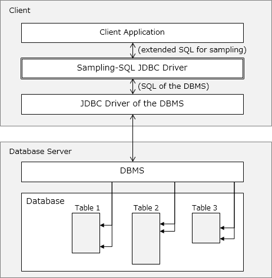

# Sampling-SQL User's Guide

# 1 Introduction

Sampling-SQL (hereinafter referred to as this software) adds a sample aggregation function to DBMSs with large data. This software is provided in the format of a JDBC driver and operates as a proxy software that exists between the user and the DBMS.

## 1.1 Overview

When performing an aggregation with a DBMS, it is necessary to scan all data corresponding to the query. For example, if 100 million entries of data were a hit for a query, aggregation would not end until all 100 million entries of data were checked. For this reason, the larger the data the longer the aggregation time was, making it difficult to casually execute a complex aggregation.

This software adds a sample aggregation function to DBMSs (currently compatible with Amazon Redshift and PostgreSQL). By using this software, for example, instead of executing a slow aggregation using all 100-million entities of data, it is possible to randomly extract 10,000 data entries which fit the query and perform a rapid aggregation. It is also possible to execute conventional strict aggregations using this software. In short, this software newly adds a sampling-based rapid aggregation function mostly without sacrificing the conventional aggregation function.

- Amazon Web Services, the “Powered by AWS” logo, Amazon Redshift are trademarks of Amazon.com, Inc. or its affiliates in the United States and/or other countries.

## 1.2 Key Features

Even up until now, several DBMSs supported a function which performed simple sampling in units of individual rows within a single table. However, execution of such sampling required as much time as a full scan of the table and did not make use of the benefits of sampling. In addition, actual aggregation requires more complex queries which join multiple tables. With such queries, performing simple sampling in units of individual rows with each table being joined results in different samples being used for each table.

This software overcomes such shortcomings. This software allows for a selection of the units for sample aggregation and can execute such sample aggregation far more quickly than a full scan of the tables.

By switching the units for sample aggregation, for example, it is possible to execute a query such as the following:

"Sample 10,000 customers who purchased Product A in April and calculate the average of the amounts paid by those customers for their purchases" (sampling in units of customers)

"Randomly select 1,000 receipts from purchases of Product A in April and create a list of products purchased at the same time" (sampling in units of receipts)

This software is able to easily and rapidly execute such complex sampling.

## 1.3 System Configuration

This software operates as a proxy software that exists between the user and the DBMS. First, use this software to convert the table to be used with sampling into a structure appropriate for sampling, and then save this as a new table. This software accepts from the user sample aggregation queries written using extended SQL for sampling. The entered extended SQL is rewritten as conventional SQL of the DBMS, samples corresponding to the conditions are collected from the DBMS, and the aggregation results are returned to the user. When SQL written using the conventional format is entered, normal non-sampled aggregation results are returned. For this reason, from the user's perspective, it almost seems as if a sample aggregation function has been newly added to the DBMS.

## 1.4 Limitations of This Software

This software realizes an increase in speed by using sampling to select a small amount of data from a large amount of data. For this reason, the benefit of increased speed becomes greater the larger the amount of data to begin with. As a general guide, speed increases with sampling when the data contains at least 100 million entries. Meanwhile, if the data consists of only a few million entries, the increase of speed due to sampling may not be too noticeable.

In order to use a query that performs sampling, it is necessary to first convert in advance the table to be used for sampling into a structure appropriate for sampling, and then save this to a new table. Using this table converted for sampling with the query enables rapid sampling based on various units.

This software currently does not support the data-updating process.

A part of the JDBC features are not implemented yet. For example, PreparedStatement using extended SQL for sampling is not implemented.

# 2 Overview of System

This section explains the overview of this software.

## 2.1 Operating Environment

This software is provided in the format of a JDBC driver. The application on a client machine operates via this software by connecting to the DBMS by using JDBC. JDBC is an interface (API) for Java programs to access databases. For this reason, the following preparations are at least necessary in order for this software to operate.

- A client machine on which Java (version 8 or above) operates
- A JDBC driver unique to the DBMS
- A client application capable of accessing the DBMS via the JDBC driver

## 2.2 Configuration and Characteristics

Sample aggregation using this software operates with the system configuration of Fig. 1.

The system is configured of what can be largely classified as a client machine and a DB server.

A client application controlled by the user operates on the client machine. For example, SQL Workbench/J which is a free OSS can be used as the client application. When the user enters SQL in the client application, the client application uses two JDBC drivers to access the DBMS and obtain sample data.

Fig. 1 System configuration

A characteristic of the configuration of this software is that it uses two JDBC drivers. The SQL for sampling entered by the user is not directly sent to the DBMS but instead is once handed over to Sampling-SQL JDBC driver. The Sampling-SQL JDBC driver is the main part of this software. This Sampling-SQL JDBC driver translates the SQL for sampling into normal SQL and makes the DBMS execute sampling via the JDBC driver of the DBMS. With this structure, the sampling function is added without manipulating the DBMS itself. The Sampling-SQL JDBC driver serves the role of a relay proxy which wraps the JDBC driver of the DBMS and makes it seems as if it has a sampling function.

## 2.3 Flow of Internal Processing

This section explains the internal processing that takes place when this software connects to the DBMS and executes sample aggregation. As this information is merely provided for reference, there is no need to understand the details in order to use this software from the outside as a user.

1. The user inputs SQL for sampling using a client application. SQL for sampling is described using syntax uniquely extended for sampling.
1. The client application hands over the SQL input from the user to the Sampling-SQL JDBC driver for sampling. This Sampling-SQL JDBC driver operates as the controller for sampling.
1. The Sampling-SQL JDBC driver brings up the JDBC driver of the DBMS and issues a sampling command. This sampling command is described with normal SQL.
1. The JDBC driver of the DBMS connects to the DBMS operating on the DB server, samples several entries of data, determines if the sampled data satisfies the conditions, and returns the determination results to the Sampling-SQL JDBC driver.
1. The Sampling-SQL JDBC driver makes the DBMS execute sampling for as many times as necessary until the sampled data satisfies the conditions.
1. Once the sampled data satisfies the conditions, next an aggregation command is sent to the JDBC driver of the DBMS. The JDBC driver of the DBMS obtains aggregation results and then return the results to the Sampling-SQL JDBC driver. The client application receives the aggregation results from the Sampling-SQL JDBC driver and displays these on the screen.

# 3 Installing the Client Application

This software is provided in the format of a JDBC driver. In order to execute sampling SQL queries, a client application to serve as a user interface is required. Sampling SQL queries that are input to the client application are translated into normal SQL with this software and sent to the DB.

In this section, how to install SQL Workbench/J as the client application is explained as an example. SQL Workbench/J is a GUI tool for connecting to databases via JDBC. As how to perform the installation is also available on the official Amazon Redshift website, refer to this website as needed.

In order to utilize SQL Workbench/J as the client application for this software, it is necessary to link to two JDBC drivers. The first is the Sampling-SQL JDBC driver included in this software. The other is the JDBC driver unique to the DBMS.

The setup procedures for SQL Workbench/J are as follows:

1. Place the .jar files of the two following JDBC drivers in a suitable folder:
   1. Sampling-SQL JDBC driver (sampling-sql-0.0.1-SNAPSHOT-jar-with-dependencies.jar)
   1. JBDC driver of the DBMS
1. Download, unzip, and launch SQL Workbench/J.
1. As the [Select Connection Profile] window will open, click the [Manage Drivers] button in the bottom left.
1. As the [Manage Drivers] window will open, click the [Create a new entry] icon in the top left and input the details as follows:
   1. For Name, input a suitable name that is easy to understand
   1. For Library, specify the .jar files of the two JDBC drivers explained earlier.
   1. As the two driver names will be displayed in a window labeled [Please select one driver], select "com.necsoft.vtc.ssql.Driver" and click OK.
   1. Finally, click [OK] and close the [Manage Driver] window.
1. Input connections settings in the [Select Connection Profile] as follows:
   1. In the Driver field, select the driver added earlier.
   1. For URL, input the URL of the database. The URL is "sample:" added to the beginning of the JDBC connection URL for connecting to the DBMS. For example, the URL will look like the following:  
      sample:jdbc:DBMS_NAME://SERVER_NAME:PORT/DB_NAME
   1. For Username and Password, input those for the DB.
   1. Finally, click [OK].
1. The Statement input window will be displayed.

The above completes preparations for executing SQL for sampling using SQL Workbench/J. The following chapters explain how to describe SQL for sampling.

# 4 Sample Key

This section explains the sample key which is the most important concept to understand in using this software.

## 4.1 What is the Sample Key? 

When analyzing data, it is necessary for analysts to aggregate the data using various units. For example, an analyst may want to sample several people from amongst millions of customers, calculate the purchase amount of each, and then plot the distribution of the purchase amounts on a graph. Perhaps in a different case, the analyst may want to sample a few receipts and plot the purchase amount per receipt on a graph.

Being able to freely configure the unit, such as "customer" or "receipt" in these cases, subject to sampling is a key feature of this software. (To explain using statistical terms, this means being able to freely select the population element to be subject to sampling.) 

With this software, it is necessary to specify in advance as the sample key, a column representing such element to be used as the unit for sampling. When the sample key is specified, this software sorts the data within the database based on the values of this sample key. This enables rapid calculation of sampling.

For example, specifying a column representing customers and a column representing receipts as sample keys makes it possible to execute "sampling in units of customers" and "sampling in units of receipts" when later executing sampling.

Interpret this as being similar to creating an index within the DBMS in order to increase speed. By creating an index for a certain column, access to data which includes that column as a condition is sped up with the DBMS. Similar to this, with this software, specifying a certain attribute as the sample key makes it possible to execute rapid sampling based on that attribute.

As the sample key is a new concept which did not exist with conventional DBMSs, this may be difficult to understand at first. However, it is an important concept as setting this key makes it possible to rapidly execute advanced statistical analyses.

## 4.2 How to Select the Sample Key

A column for which the number of distinct values exceeds 100,000 is a column appropriate to select as the sample key. For example, this could be the customer ID, order ID, or session ID. If there are 1 million customers, the cost required for calculation can be reduced to 1/100 by randomly selecting 10,000 customers. Meanwhile, sampling is not effective when selecting a column with a limited number of distinct values such as country name or gender.

If your database is configured with a star schema and there exists a large dimension table, it is recommended that you specify that key as the sample key for both the fact table and the dimension table. Doing so makes it possible to simultaneously sample and join the fact table and dimension table which speeds up calculations.

You can specify as many sample keys as you want for a single table. However, it is recommended that this is kept within approximately five columns for a single table. (An excessive number of sample keys may actually slow down sampling.)

Currently, only numeric columns can be used as the sample key. String columns cannot be used.

# 5 Converting Tables

In order to use queries that perform sampling, it is necessary to sort in advance the data to be used for sampling into a structure appropriate for sampling.

This software has a function which sorts all data within a table according to the sample key specified by the user and then saves this to a new table for sampling. This process of saving data to this new table for sampling is referred to as table conversion. Note that changes will not be made to the original table.

Using this new table converted for sampling with a query makes it possible to perform rapid sampling with various units.

## 5.1 Level Columns

New columns are added to the table converted for sampling. These are referred to as level columns. These columns are for use by this software when obtaining samples. There is no need for the user to directly operate these columns. One level column is added for every sample key the table contains.

These level columns are named "_SampleKeyName_LEVEL". For example, if the "ORDERKEY" column is specified as the sample key in a table, a column labeled "_ORDERKEY_LEVEL" is newly added to this table.

These level columns are utilized as the clustering key on the DB. In other words, rows contained in the table are saved upon being clustered based on combinations of level columns. This software realizes rapid sampling by performing the sampling upon internally specifying level columns.

## 5.2 Converting Tables

Table conversion is performed by executing SQL extended by adding, to the CREATE TABLE statement used to define the conversion source table, statements which specify the sample keys. When this SQL is executed, the conversion for sampling is performed in reference to the conversion source table and the converted results are saved to a new table. The conversion source table is not altered even when this SQL is executed.

This page explains this extended syntax.

First, let's look at a simple example.

Let's say that a database contains a table named "orders" which represents past order histories and each row therein represents a single order. This table has a column labeled "custkey" and the value of "custkey" represents the ID of the customer who made the order. Let's also say that this table contains an "orderkey" column and "price" column.

Now, to specify this "custkey" column as the sample key, convert the table, and save the converted new table with the name "s_orders", execute SQL as follows:

    SAMPLE TABLE s_orders (custkey)
    CREATE TABLE orders (
      orderkey INTEGER NOT NULL,
      custkey INTEGER NOT NULL,
      price DECIMAL(15, 2) NOT NULL
    )

The first line of this CREATE TABLE statement is the unique extension. The SAMPLE TABLE expression represents the table name after the conversion and the sample key column to be used.

The second and subsequent lines are the CREATE TABLE statement for the conversion source table.

It is necessary to describe just one SAMPLE TABLE expression before the CREATE TABLE statement for the conversion source table. The description being placed in a different position will result in a syntax error. There being two or more SAMPLE TABLE expressions will also result in a syntax error.

This section explains this SAMPLE TABLE expression.

The SAMPLE TABLE expression is described using the following syntax:

    SAMPLE TABLE TableAfterConversion ( TargetSampleKey+ )

The plus sign (+) here indicates that multiple "TargetSampleKey" can be described by separating each with a comma.

For "TableAfterConversion", describe the table name of the table to save the conversion results in.

The table name after conversion being a name that already exists will result in an error.

For "TargetSampleKey", specify the column name of the sample key to use for sampling.

For this target sample key, specify a column defined in the conversion source table. The specified target sample key being anything other than a column of the conversion source table will result in an error.

The table name after conversion and the target sample key name must be an unqualified name.

## 5.3 Points to Note

When SQL for converting a table is executed, the results of data sorted for sampling in reference to the table prior to conversion are saved to the table after conversion. In other words, as the sort process and sort results insertion process are performed on the DBMS, the table conversion may require a long time.

After executing SQL for converting a table, execute COMMIT as necessary.

# 6 Sampling SQL

In order to realize a sampling function, this software adds unique extensions to the conventional SQL syntax for DBMSs.

This page explains this extended syntax.

First, let's look at a simple example.
Let's say that a database contains a table named "orders" which represents past order histories and each row therein represents a single order. This table has a column labeled "custkey" and the value of "custkey" represents the ID of the customer who made the order. Further, the table conversion explained in the previous chapter is executed, the table name after conversion is "s_orders", and the specified sample key is "custkey".
Now, let's randomly extract the data for at least 100 customers from the s_orders table. This query can be written as follows:

    SAMPLE s_orders BY custkey
    UNTIL 100 <= (SELECT COUNT(DISTINCT custkey) FROM s_orders)
    SELECT * FROM s_orders 

The first and second lines of this query are the unique extensions for specifying the sampling method.
The SAMPLE expression represents which sample key to use and which table to sample from. The UNTIL expression represents the condition for ending sampling.
If the condition for ending sampling is satisfied, the main SELECT statement is executed. In this example, the third line is the main SELECT statement.

The SAMPLE expression and the UNTIL expression must be specified simultaneously. Queries with a SAMPLE expression yet no UNTIL expression, or queries with an UNTIL expression yet no SAMPLE expression will result in a syntax error. Also note that no more than one each of the SAMPLE expression and the UNTIL expression can be used. Queries with two or more SAMPLE expressions and queries with two or more UNTIL expressions will result in a syntax error.

This section explains these two expressions in detail.

## 6.1 SAMPLE Expression

The SAMPLE expression is described using the following syntax:

    SAMPLE {{TargetTable {AS SampleTable}?}+ BY TargetSampleKey}+

The question mark (?) here indicates that the item can be omitted.  
The plus sign (+) indicates that the item can be repeated by separating each with a comma.  
Curly braces ({}) indicate groups within the syntax. There is no need to describe the curly braces in SQL.

For "TargetTable", describe the table name to be subject to sampling. For the target table, specify a table after conversion as explained in the previous chapter.

For "TragetSampleKey", specify the sample key to use as the unit for sampling this time. It is necessary that the target sample key is configured as one of the sample keys of the target table. If the specified target sample key is not a sample key of the target table, the process will result in an error.

The samples generated from the target table are referred to as the "sample table". A separate name can be specified for this sample table by using the AS expression. When the AS expression is omitted, the name of the sample table will be the same as that of the target table. Be careful as in such case, it will not be possible to distinguish between the target table and sample table in the same query. In other words, when the AS expression is omitted, the name of the target table used in a query will point to the sample table generated by extracting samples from the target table.

The sample table is temporarily generated inside this software upon query execution. It is not generated on the database as an actual table.

The target table name can be either a qualified name or an unqualified name. The target sample key name must be an unqualified name. The target sample key is regarded as a column that exists in the preceding target table.

Let's look at an example.

Example)

    SAMPLE s_orders AS o_sample, s_customer BY custkey

In this example, "custkey" is selected as the target sample key. The target tables are the two tables of "s_orders" and "s_customer". It is necessary for "custkey" to be included in both the sample keys of s_orders and the sample keys of s_customer. The sample table generated from s_orders is given the separate name of o_sample. As the sample table generated from s_customer is not given a separate name, the name of the sample table will be s_customer which is the same name as that of the target table. In such case, it will not be possible to access the original full-size s_customer table within the same query.

Sample keys representing the same type of element in multiple tables may be given separate names. For example, it is possible that the column representing customers is a_custkey and not custkey in the s_address table. In such case, the target sample key can be specified for every table.

Example)

    SAMPLE s_orders AS o_sample, s_customer BY custkey, s_address BY a_custkey

In this example, the s_orders table and s_customer table are sampled with custkey while the s_address table is sampled with a_custkey.

As shown in the above, multiple target sample keys can be specified. However, target sample keys specified simultaneously must all be columns representing the same type of element. When the columns custkey (representing customers) and orderkey (representing orders) which represent different types of elements are specified, sampling will be simultaneously performed in relation to different populations and make it difficult to statistically interpret the calculation results.

Bad example)

    SAMPLE s_orders BY orderkey, s_customer BY custkey

## 6.2 UNTIL Expression

The UNTIL expression represents the condition for ending sampling. With this software, the sample table generated with sampling gradually becomes larger as the sampling proceeds. Rows are extracted a few rows at a time from the target table and added little by little to the sample table. The UNTIL expression specifies at which point to end this sampling.

The UNTIL expression can be described with any boolean expression that returns a boolean value. Sampling is continued as long as the calculation result of the boolean expression is FALSE and sampling will end when the calculation result of the boolean expression becomes TRUE.

Although any boolean expression can be specified as the condition for the UNTIL expression, it is necessary to describe a boolean expression that will be satisfied as the sampling proceeds. Examples of this would be conditions regarding the number of rows in the sample table or the number of distinct values the sample table contains, etc.

Let's take another look at the example used earlier.

    SAMPLE s_orders BY custkey
    UNTIL 100 <= (SELECT COUNT(DISTINCT custkey) FROM s_orders)
    SELECT * FROM s_orders

In this example, a sample table with the same name is generated from the target table s_orders. The name s_orders which appears in the UNTIL expression is pointing to the sample table. With this UNTIL expression, sampling is continued until the number of distinct custkey values the sample table contains exceeds 100.

Worth noting is that the generated sample table will not be a sample of the minimum size that satisfies the condition. As the sampling proceeds, the amount of data extracted from the target table and added to the sample table at once increases. Then, every time the addition ends, it is determined if the condition specified with the UNTIL expression is satisfied. For this reason, depending on the amount of data added at once, a number of data entries greater than the specified condition may be collected.

With the above example, sampling will end as soon as the data for at least 100 customers is added to the sample table. At this time, data for 112 customers might exist in the sample table. Or perhaps, data for 198 customers might exist.
(Although this will also depend on the parameter settings, the amount of data will not be exceptionally greater by several times the specified condition.)

However, there will be no cases where only some of the multiple rows regarding the same element is included in the sample table. For example, if one customer has made three orders, or in other words when three rows of orders belong to a single customer, either all three rows of orders will be included in the sample table or all three rows of orders will not be included in the sample table. There will be no cases where only one row or two rows out of the three rows of orders are included in the sample table.

## 6.3 _factor Variable

This software samples the element the target sample key represents and ends sampling when the UNTIL condition is satisfied. The sampled element is only a small part of all of the elements. Then, exactly what percentage of the elements of the target table are sampled?

The extended SQL of this software prepares a special variable to represent this ratio. That is the _factor variable. The _factor variable is an estimate of the following ratio:

    (Number of elements included in the target table) / (Number of elements included in the sample table)

The _factor variable can be used in SQL with the keyword _factor. The underscore at the beginning is assigned to represent that this variable is not an ordinary variable. By using the _factor variable, for example, it is possible to estimate a total value for the entire data based on the total value from within the samples.

Let's look at an example.

    SAMPLE s_orders BY custkey
    UNTIL 100 <= (SELECT COUNT(DISTINCT custkey) FROM s_orders)
    SELECT SUM(price) * _factor FROM s_orders

When this query is executed, sampling ends when the sample table s_orders contains data for at least 100 customers. As explained earlier, the number of entries will not be for exactly 100 customers. Suppose the sample table contains data for 105 customers. Meanwhile, let's suppose the s_orders table contains data for 1 million customers. At this point, the (Number of elements included in the target table) / (Number of elements included in the sample table) is approximately 950,000. For this reason, the value of _factor variable will be approximately 950,000.

The result from a multiplication of the _factor to determine the total value within the sample table is output in the third line of this query. This is the estimated value for the total value of the target table. By multiplying the total for the 105 customers with approximately 950,000 which is the value of the _factor variable, it is possible to estimate the total value for the 1 million customers in the s_orders table.

_factor can be used only with queries that include the SAMPLE expression. Use in any other case will result in an error. As _factor is a keyword similar to SELECT, etc. and not an identifier, use inside quotation marks like "_factor" in SQL will also result in an error.

## 6.4 Description Method for Using the WITH Expression

The explanations up to the previous chapters completed the explanations of the SAMPLE expression and the UNTIL expression. Sample aggregation queries can be freely created with just these two expressions. However, with just the SAMPLE expression and the UNTIL expression, the writing for the query may be redundant. This chapter and the next chapter explain how to avoid redundant descriptions.

The WITH expression is an SQL syntax which defines a temporary table.

The SAMPLE expression and the UNTIL expression can be used in combination with the WITH expression. By doing so, common processes can be described all together in a temporary table. The order of the descriptions is the SAMPLE expression, the WITH expression, and then the UNTIL expression. Sample table names defined by the SAMPLE expression can be used within the WITH expression. Table names defined by the SAMPLE expression and the WITH expression can be used within the UNTIL expression.

Let's look at an example.

    SAMPLE s_orders AS o_sample, s_customer BY custkey
    WITH temp AS (SELECT * FROM o_sample, s_customer USING (custkey))
    UNTIL 100 <= (SELECT COUNT(DISTINCT custkey) FROM temp)
    SELECT * FROM temp

In this example, the two sample tables of o_sample and s_customer are defined by the SAMPLE expression. The WITH expression defines a new table, temp, created by equi-join these two sample tables with custkey. The UNTIL expression defines that sampling is to be continued until the data for at least 100 customers is included in this temp table. The SELECT statement at the end specifies that all rows are to be read out from the temp table generated in such manner.

Worth noting is that use of the WITH expression got rid of the need to write the same process twice. Despite the UNTIL expression in the third line and the SELECT statement in the fourth line both being a process in regard to the table created by joining the two sample tables, this common process did not need to be written twice since the WITH expression was used.

## 6.5 Description Method for Using the 'this' Table

This chapter goes on to explain an efficient description method which uses the 'this' table. The 'this' table, unlike the WITH expression, is uniquely defined by this software. Although the description method for using the 'this' table is a little peculiar and will take some getting used to, once you get used to it, it will allow you to efficiently describe complex queries.

In the examples so far, the UNTIL expression was described immediately before the main SELECT statement. However, the UNTIL expression can also be nested and used within the main SELECT statement. The description position is after the WHERE expression and before the GROUP BY expression. Within this UNTIL expression nested here, conditions can be described using the table called the 'this' table. The 'this' table is a temporary and separate name given to the table of results from filtering, with the WHERE expression, the table specified with the FROM expression of the SELECT statement.

The UNTIL expression cannot be used within a subquery.

Let's look at an example.

    SAMPLE s_orders BY custkey
    SELECT COUNT(*)
    FROM s_orders
    WHERE price >= 1000
    UNTIL 100 <= (SELECT COUNT(DISTINCT custkey) FROM this)
    GROUP BY custkey

In this query, the UNTIL expression is nested in the SELECT statement and the table name 'this' is being used. This UNTIL expression is executed upon actually being interpreted in the following manner:

    UNTIL 100 <= (SELECT COUNT(DISTINCT custkey) FROM
    (SELECT *
    FROM s_orders
    WHERE price >= 1000
    ) AS this)

The FROM expression and the WHERE expression of the original SELECT statement are extracted to configure the 'this' table. Aggregate functions used by the GROUP BY expression and the SELECT expression are not included.

This query filters orders with a price of 1,000 or more from amongst multiple orders included in the s_orders table. Then, when such orders for 100 customers have been collected, the number of orders per customer is output.

As shown here, it is possible to avoid writing the same process twice by using the 'this' table. In the above example, the condition in regard to the price of the WHERE expression has been made common.

The syntax that can be described using the 'this' table can also be described using the WITH expression. Simply nest the portion corresponding to the above common process as the temporary table of the WITH expression. Which syntax you use is only a matter of preference. The description using the 'this' table will look more like conventional SQL but this may make it more difficult to intuitively understand that only the FROM expression and the WHERE expression are extracted. Meanwhile, although the description method using the WITH expression may be difficult to approach for users who are not used to the WITH expression, it will make it easier to understand which process is being made common. Select the syntax which is easier for you to write.

## 6.6 Non-supported Functions

This software does not support the update command for tables after conversion. For this reason, refrain from performing the update command for tables after conversion (tables with a level column). There will be no problem with updating conversion source tables (tables without a level column). However, the content updated on the conversion source tables will not be reflected onto the tables after conversion.

Currently, only SELECT INTO is supported as a method for saving the sampling execution results. In other words, by specifying INTO in a SELECT statement that has the SAMPLE expression and UNTIL expression, the sampling execution results can be saved as a table.

Other methods for saving the query execution results, for example combinations with INSERT, UPDATE and CREATE TABLE / VIEW AS, are currently not supported. If you wish to further use the sampling execution results for a different operation, save the results once to a table using SELECT INTO, and then load the data from that table.

Apart from this, extended SQL that contains the SAMPLE expression cannot be used in combination with the syntaxes listed below. However, the following syntaxes can also be used freely when using normal SQL that does not contain the SAMPLE expression:

- Statement preparation (PREPARE, EXECUTE)
- EXPLAIN
- Cursor (DECLARE, FETCH, CLOSE)
- UNLOAD

## 6.7 Points to Note

The following four words are reserved words in the extended SQL for sampling. Using these words as a table name or column name will result in an error.

    SAMPLE, UNTIL, THIS, _FACTOR

Identifiers with quotation marks can be used in the extended SQL for sampling. However, make sure that an identifier with quotation marks and the same identifier without quotation marks do not coexist in the same query. For example, "lineitem" coexisting with lineitem will not operate properly.
